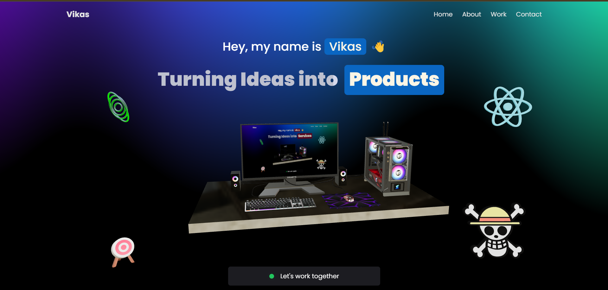

# Portfolio - Three.js & React

Welcome to my portfolio! This project showcases my experience, skills, and projects using an interactive 3D environment built with **Three.js**, **React**, and **@react-three/drei**.

## 🚀 Live Demo
<!-- Check out the live version of my portfolio: [Live Demo](#) (Update with actual link) -->

## 📌 Features
- **3D Interactive Portfolio** – Explore my experience and projects in a visually engaging way.
- **Built with Three.js & Drei** – Leveraging @react-three/drei for enhanced 3D components.
- **Optimized Performance** – Efficient rendering and animations.
- **Responsive Design** – Works across different screen sizes and devices.
- **Customizable UI** – Dynamic content displayed on in-world screens.

## 🛠️ Tech Stack
- **Frontend:** React, Three.js, @react-three/fiber, @react-three/drei, TypeScript
- **Styling:** Tailwind

## 📷 Screenshots


## 🏗️ Installation & Running Locally
To run the project locally, follow these steps:

```bash
# Clone the repository
git clone https://github.com/vikaschouhan97/portfolio-threejs

# Navigate to the project directory
cd portfolio-threejs

# Install dependencies
npm install

# Start the development server
npm run dev  # or npm start
```

## 🔥 Customization
- Update `src/assets` with your own 3D models and textures.
- Modify `src/components` to personalize UI and animations.

## 📬 Contact
If you have any questions or suggestions, feel free to reach out:
- 📧 Email: vikaschouhan360@gmail.com
- 💼 LinkedIn: [https://www.linkedin.com/in/vikas-chouhan-646403121/](#)
- 🐦 Twitter: [https://x.com/VikasChouhan97](#)

## ⭐ Show Your Support
If you like this project, please consider giving it a ⭐ on GitHub!

---
Made with ❤️ by Vikas Chouhan

